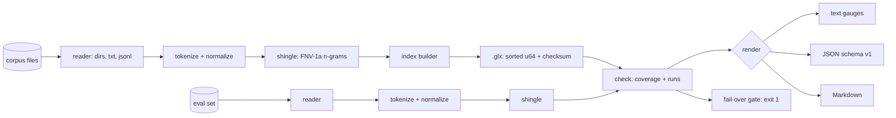

# gramleak

[English](README.md) | [中文](README.zh.md) | [日本語](README.ja.md)

[](LICENSE) [](go.mod) [](CHANGELOG.md)  [](CONTRIBUTING.md)

**gramleak：リリース前に評価セットの汚染を捕まえるオープンソース・依存ゼロの CLI——ベンチマークと任意の学習/few-shot コーパスの重なりをハッシュ化 n-gram で測定し、逐語的な証拠と終了コードによる失敗ゲートを添える。**


```bash
git clone https://github.com/JaydenCJ/gramleak && cd gramleak
go build -o gramleak ./cmd/gramleak    # single static binary, stdlib only
```

> プレリリース：v0.1.0 はまだどのパッケージレジストリにも公開されていません。上記の手順でソースからビルドしてください（Go ≥1.22 なら可）。

## なぜ gramleak？

ベンチマーク汚染のスキャンダルが繰り返される理由は単純で、怪しいほど高いスコアに追及されるまで誰もリークチェックを走らせないからです。プライベート評価を作るチームの悩みはその逆——毎リリース前に*チェックしたい*のに、手元のツールの形が合いません：研究用の重複除去コード（学習セット洗浄のためのサフィックス配列パイプラインで、評価監査の道具ではない）、汎用 MinHash ライブラリ（トークン化・しきい値・レポートを全部自作）、あるいは苦し紛れの `grep`（大文字小文字や改行・句読点が変わった箇所を全て見逃す）。gramleak はその欠けていた専用ステップです：`index` が任意のコーパスをハッシュ化トークン 8-gram の集合（指紋のみでテキストを一切含まない、共有可能な `.glx` ファイル）へストリーム圧縮し、`check` がその n-gram が各評価ドキュメントをどれだけ覆うかを測定——重なった原文パッセージをそのまま引用して見せ、どれかが限度を超えた瞬間に終了コード 1 で止まります。バイナリ 1 つ、Python スタックなし、ネットワークなし、数秒で完了。

| | gramleak | 研究用重複除去パイプライン | MinHash ライブラリ | grep / 即席スクリプト |
|---|---|---|---|---|
| 評価汚染専用に作られた CLI | ✅ | ❌ 学習セット洗浄向け | ❌ 道具箱であって道具ではない | ❌ |
| すべてのフラグに逐語的証拠 | ✅ バイトオフセットのスパン | ❌ | ❌ | 行ヒットのみ |
| テキストを渡さずコーパス索引を共有 | ✅ `.glx` 指紋 | ❌ | ❌ | ❌ |
| 終了コード付きリリースゲート | ✅ `--fail-over` | ❌ | 自作 | 自作 |
| 大小文字/句読点/改行の変化に耐える | ✅ 正規化トークン | 部分的 | 実装次第 | ❌ |
| shingle パラメータ不一致の比較を拒否 | ✅ パラメータは索引内に保存 | ❌ | ❌ | 対象外 |
| ランタイム依存 | 0 | Rust ツールチェーン + Python | Python + numpy/scipy | 0 |

<sub>依存数は 2026-07-13 に確認：gramleak は Go 標準ライブラリのみを import。datasketch（Python）は numpy と scipy を取得。サフィックス配列パイプラインは Rust ツールチェーンに加え Python ドライバスクリプトが必要。</sub>

## 機能

- **引用できる汚染レポート** — フラグされた各ドキュメントに、バイトオフセットから復元し逐語引用した重なり区間が付属。レポートは根拠であって雰囲気ではない。
- **ハッシュ shingle と共有可能な索引** — `.glx` はソート済み 64 ビット FNV-1a 指紋とチェックサムを格納。データ所有者はこれを渡しても学習テキストを 1 トークンも明かさない。
- **本物のリリースゲート** — `check --fail-over 30` はどれかの評価ドキュメントがトークン被覆率 30% に達した瞬間に 1 で終了。用法エラーは 2、実行時エラーは 3 で、パイプラインが正確に反応できる。
- **フォーマット変化に強い** — 大文字小文字を畳む Unicode トークン化が句読点と改行を無視。任意の `--mask-digits` はテンプレ化リーク（"question 17 of 40" 対 "question 3 of 40"）も捕捉。
- **現実のデータセット形状に対応** — ディレクトリは決定的に走査、テキストは `--split file|line|para`、JSONL/NDJSON は `--field` でドット記法パス。壊れたレコードは `file:line` 付きのハードエラーで、黙って飛ばさない。
- **3 つのレポート形式** — 人間向けターミナルゲージ、機械向けの安定 JSON（`schema_version: 1`、再実行でバイト一致）、そして証拠セクション付きの PR 用 Markdown。
- **依存ゼロ・完全オフライン** — Go 標準ライブラリのみ。ローカルのファイルを読み、ローカルにレポートを書き、どこへも何も送らない。

## クイックスタート

```bash
# fabricate a demo dataset: a training corpus + 6 eval questions, 2 of them leaked
bash examples/make-demo-data.sh demo
./gramleak index --out corpus.glx demo/corpus
./gramleak check --index corpus.glx --field question demo/eval
```

実際にキャプチャした出力：

```text
gramleak check — demo/eval vs corpus.glx
index: 119 shingles (n=8, case-folded, digits verbatim) from 6 documents / 170 tokens

contamination
  overall  ███████░░░░░░░░░░░░░░░░░   28.1%  (36/128 tokens)
  worst    demo/eval/questions.jsonl:1 at 87.5%
  flagged  2 of 6 documents at ≥ 5.0%

flagged documents
   87.5%  █████████████████████░░░  demo/eval/questions.jsonl:1  (longest run 21 tokens)
          └─ 21 tokens: "Photosynthesis is the process by which green plants convert sunlight, water and carbon dioxide into oxygen and glucose inside their chloroplasts"
   71.4%  █████████████████░░░░░░░  demo/eval/questions.jsonl:2  (longest run 15 tokens)
          └─ 15 tokens: "the Turing test, proposed in 1950, measures a machine's ability to exhibit intelligent behaviour"

6 documents checked
```

リリースの門番にする（`--fail-over`、実出力、終了コード 1）：

```text
gate: max contamination 87.5% ≥ fail-over 30.0% → FAIL
```

単発チェックに索引ファイルは不要：`--against demo/corpus --corpus-field text` が shingle 集合をメモリ上に構築します。`--format json` と `--format markdown` は同じ数値の機械版・PR 版を出力します。

## CLI リファレンス

`gramleak [index|check|stats|version]` — 終了コード：0 正常、1 fail-over 超過、2 用法エラー、3 実行時エラー。

| フラグ | 既定値 | 効果 |
|---|---|---|
| `--out`（index） | — | 出力 `.glx` ファイル、必須 |
| `-n` | `8` | shingle サイズ（トークン数；index / `--against` モード） |
| `--case-sensitive` | オフ | Unicode の大小文字畳み込みを無効化 |
| `--mask-digits` | オフ | 数字列を畳んでテンプレ化テキストも一致させる |
| `--field` | `text` | JSONL のテキストフィールド、ドット記法可（`data.question`） |
| `--split` | `file` | テキスト分割：`file`・`line`・`para` |
| `--index` / `--against`（check） | — | `.glx` を読む / メモリ内索引を構築（繰り返し可） |
| `--corpus-field`・`--corpus-split` | = 評価側フラグ | `--against` コーパス専用の入力オプション |
| `--threshold` | `5.0` | 汚染率がこのパーセント以上のドキュメントをフラグ |
| `--fail-over` | 未設定 | どれかがこのパーセントに達したら 1 で終了 |
| `--top` | `3` | ドキュメントごとに表示する証拠スパン数 |
| `--min-tokens` | `n` | これより短い評価ドキュメントをスキップ |
| `--format` | `text` | `text`・`json`・`markdown` |
| `--all` | オフ | クリーンなドキュメントも一覧に含める |

汚染率とはトークン被覆率：コーパスにも出現する n-gram に少なくとも 1 つ覆われたトークンの割合です。`.glx` フォーマット——そして壊れた索引が決して黙って「クリーン」と報告しない理由——は [docs/index-format.md](docs/index-format.md) を参照。

## 検証

このリポジトリに CI はありません。上記の主張はすべてローカル実行で検証しています：

```bash
go test ./...            # 89 deterministic tests, offline, < 5 s
bash scripts/smoke.sh    # end-to-end CLI check, prints SMOKE OK
```

## アーキテクチャ



## ロードマップ

- [x] v0.1.0 — GLXI 索引フォーマット、逐語証拠スパン付きトークン被覆率チェッカー、text/JSON/Markdown レポート、`--fail-over` ゲート、`--against` 単発モード、89 テスト + smoke スクリプト
- [ ] 評価セット内部の重複検出（評価問題同士のリークをフラグ）
- [ ] 厳密な shingle 集合が載らない超大規模コーパス向けの Sketch モード（MinHash）
- [ ] CJK 密度の高いコーパス向け文字レベル shingle オプション
- [ ] コーパスの版間で 2 つの `.glx` 索引を比較する `diff` サブコマンド
- [ ] 数 GB 級学習ダンプ向けの並列コーパス取り込み

全リストは [open issues](https://github.com/JaydenCJ/gramleak/issues) を参照。

## コントリビュート

Issue・ディスカッション・PR を歓迎します——ローカルの作業フロー（整形、vet、テスト、`SMOKE OK`）は [CONTRIBUTING.md](CONTRIBUTING.md) を参照。入門タスクは [good first issue](https://github.com/JaydenCJ/gramleak/issues?q=is%3Aissue+is%3Aopen+label%3A%22good+first+issue%22)、設計の議論は [Discussions](https://github.com/JaydenCJ/gramleak/discussions) へ。

## ライセンス

[MIT](LICENSE)
