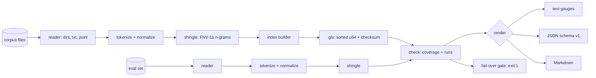

# gramleak

[English](README.md) | [中文](README.zh.md) | [日本語](README.ja.md)

[](LICENSE) [](go.mod) [](CHANGELOG.md)  [](CONTRIBUTING.md)

**gramleak：an open-source, zero-dependency CLI that catches eval-set contamination before release — hashed n-gram overlap between your benchmark and any training or few-shot corpus, with verbatim evidence and an exit-code fail gate.**


```bash
git clone https://github.com/JaydenCJ/gramleak && cd gramleak
go build -o gramleak ./cmd/gramleak    # single static binary, stdlib only
```

> Pre-release: v0.1.0 is not tagged on a package registry yet; build from source as above (any Go ≥1.22).

## Why gramleak?

Benchmark contamination scandals keep recurring for a simple reason: nobody runs a leak check until a suspiciously high score forces them to. Teams building private evals have the opposite problem — they *want* to check every release, but the available tooling is wrong-shaped: research dedupe code (suffix-array pipelines built to clean training sets, not to audit an eval), general-purpose MinHash libraries that leave you to build tokenization, thresholds and reporting yourself, or a desperate `grep` that misses anything re-cased, re-wrapped or re-punctuated. gramleak is the missing purpose-built step: `index` streams any corpus into a compact set of hashed token 8-grams (a shareable `.glx` file that contains fingerprints, never text), and `check` measures what fraction of each eval document those n-grams cover — then quotes the exact overlapping passages back at you and exits 1 if any document crosses your limit. One binary, no Python stack, no network, done in seconds.

| | gramleak | research dedupe pipelines | MinHash libraries | grep / ad-hoc scripts |
|---|---|---|---|---|
| Purpose-built eval-contamination CLI | ✅ | ❌ training-set cleaning | ❌ toolkit, not a tool | ❌ |
| Verbatim evidence for every flag | ✅ byte-offset spans | ❌ | ❌ | line hits only |
| Share the corpus index without the text | ✅ `.glx` fingerprints | ❌ | ❌ | ❌ |
| Release gate with exit codes | ✅ `--fail-over` | ❌ | DIY | DIY |
| Survives case/punctuation/wrapping churn | ✅ normalized tokens | partial | depends on your code | ❌ |
| Refuses mismatched shingling parameters | ✅ params live in the index | ❌ | ❌ | n/a |
| Runtime dependencies | 0 | Rust toolchain + Python | Python + numpy/scipy | 0 |

<sub>Dependency counts checked 2026-07-13: gramleak imports the Go standard library only; datasketch (Python) pulls numpy and scipy; suffix-array dedupe pipelines need a Rust toolchain plus Python driver scripts.</sub>

## Features

- **Contamination you can quote** — every flagged document comes with its overlapping runs reconstructed from byte offsets and quoted verbatim, so a report is an argument, not a vibe.
- **Hashed shingles, shareable indexes** — the `.glx` file stores sorted 64-bit FNV-1a fingerprints plus a checksum; a data owner can hand it over without revealing one token of training text.
- **A real release gate** — `check --fail-over 30` exits 1 the moment any eval document reaches 30% token coverage; usage errors exit 2, runtime errors 3, so pipelines can react precisely.
- **Formatting-churn resistant** — Unicode tokenization with case folding drops punctuation and wrapping; optional `--mask-digits` catches templated leaks ("question 17 of 40" vs "question 3 of 40").
- **Eats real dataset shapes** — directories walked deterministically, `--split file|line|para` for text, `--field` with dotted paths for JSONL/NDJSON; malformed records are hard errors with `file:line`, never silent skips.
- **Three report formats** — terminal gauges for humans, stable JSON (`schema_version: 1`, byte-identical re-runs) for machines, and PR-ready Markdown with an evidence section.
- **Zero dependencies, fully offline** — Go standard library only; reads local files, writes local reports, sends nothing anywhere, ever.

## Quickstart

```bash
# fabricate a demo dataset: a training corpus + 6 eval questions, 2 of them leaked
bash examples/make-demo-data.sh demo
./gramleak index --out corpus.glx demo/corpus
./gramleak check --index corpus.glx --field question demo/eval
```

Real captured output:

```text
gramleak check — demo/eval vs corpus.glx
index: 119 shingles (n=8, case-folded, digits verbatim) from 6 documents / 170 tokens

contamination
  overall  ███████░░░░░░░░░░░░░░░░░   28.1%  (36/128 tokens)
  worst    demo/eval/questions.jsonl:1 at 87.5%
  flagged  2 of 6 documents at ≥ 5.0%

flagged documents
   87.5%  █████████████████████░░░  demo/eval/questions.jsonl:1  (longest run 21 tokens)
          └─ 21 tokens: "Photosynthesis is the process by which green plants convert sunlight, water and carbon dioxide into oxygen and glucose inside their chloroplasts"
   71.4%  █████████████████░░░░░░░  demo/eval/questions.jsonl:2  (longest run 15 tokens)
          └─ 15 tokens: "the Turing test, proposed in 1950, measures a machine's ability to exhibit intelligent behaviour"

6 documents checked
```

Gate a release on it (`--fail-over`, real output, exit code 1):

```text
gate: max contamination 87.5% ≥ fail-over 30.0% → FAIL
```

No index file needed for one-shot checks: `--against demo/corpus --corpus-field text` builds the shingle set in memory. `--format json` and `--format markdown` produce the machine and PR variants of the same numbers.

## CLI reference

`gramleak [index|check|stats|version]` — exit codes: 0 ok, 1 fail-over breached, 2 usage error, 3 runtime error.

| Flag | Default | Effect |
|---|---|---|
| `--out` (index) | — | output `.glx` file, required |
| `-n` | `8` | shingle size in tokens (index / `--against` mode) |
| `--case-sensitive` | off | disable Unicode case folding |
| `--mask-digits` | off | collapse digit runs so templated text still matches |
| `--field` | `text` | JSONL text field, dotted paths ok (`data.question`) |
| `--split` | `file` | plain-text splitting: `file`, `line` or `para` |
| `--index` / `--against` (check) | — | read a `.glx` file / build an in-memory index (repeatable) |
| `--corpus-field`, `--corpus-split` | = eval flags | separate input options for `--against` corpora |
| `--threshold` | `5.0` | flag documents at ≥ this contamination percent |
| `--fail-over` | unset | exit 1 when any document reaches this percent |
| `--top` | `3` | evidence spans shown per document |
| `--min-tokens` | `n` | skip eval documents shorter than this |
| `--format` | `text` | `text`, `json` or `markdown` |
| `--all` | off | list clean documents too |

Contamination is token coverage: the percentage of a document's tokens covered by at least one n-gram that also occurs in the corpus. The `.glx` format — and why a corrupt index can never silently report "clean" — is specified in [docs/index-format.md](docs/index-format.md).

## Verification

This repository ships no CI; every claim above is verified by local runs:

```bash
go test ./...            # 89 deterministic tests, offline, < 5 s
bash scripts/smoke.sh    # end-to-end CLI check, prints SMOKE OK
```

## Architecture



## Roadmap

- [x] v0.1.0 — GLXI index format, token-coverage checker with verbatim evidence spans, text/JSON/Markdown reports, `--fail-over` gate, `--against` one-shot mode, 89 tests + smoke script
- [ ] Intra-eval dedupe (flag eval questions that leak into *each other*)
- [ ] Sketch mode (MinHash) for corpora too large for an exact shingle set
- [ ] Character-level shingling option for CJK-dense corpora
- [ ] `diff` subcommand comparing two `.glx` indexes across corpus versions
- [ ] Parallel corpus ingestion for multi-gigabyte training dumps

See the [open issues](https://github.com/JaydenCJ/gramleak/issues) for the full list.

## Contributing

Issues, discussions and pull requests are welcome — see [CONTRIBUTING.md](CONTRIBUTING.md) for the local workflow (format, vet, tests, `SMOKE OK`). Good entry points are labelled [good first issue](https://github.com/JaydenCJ/gramleak/issues?q=is%3Aissue+is%3Aopen+label%3A%22good+first+issue%22), and design questions live in [Discussions](https://github.com/JaydenCJ/gramleak/discussions).

## License

[MIT](LICENSE)
