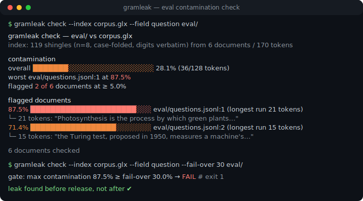
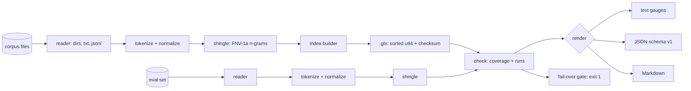

# gramleak

[English](README.md) | [中文](README.zh.md) | [日本語](README.ja.md)

[](LICENSE) [](go.mod) [](CHANGELOG.md)  [](CONTRIBUTING.md)

**gramleak：开源零依赖 CLI，在发布前抓出评测集污染——用哈希 n-gram 度量你的 benchmark 与任意训练/few-shot 语料的重叠，附可引用的原文证据和基于退出码的失败门禁。**



```bash
git clone https://github.com/JaydenCJ/gramleak && cd gramleak
go build -o gramleak ./cmd/gramleak    # single static binary, stdlib only
```

> 预发布：v0.1.0 尚未发布到任何包仓库；请按上述方式从源码构建（Go ≥1.22 均可）。

## 为什么选 gramleak？

benchmark 污染丑闻反复上演，原因很简单：在可疑的高分逼问之前，没人会去跑泄漏检查。做私有评测的团队面对的恰恰是相反的问题——他们*想*在每次发布前都查一遍，但现有工具形状不对：研究性去重代码（为清洗训练集而生的后缀数组流水线，不是评测审计工具）、通用 MinHash 库（分词、阈值、报告全要自己搭），或是绝望的 `grep`（任何改过大小写、重新换行或换过标点的内容都会漏掉）。gramleak 补上了这个缺失的专用环节：`index` 把任意语料流式压缩成哈希 token 8-gram 集合（可分享的 `.glx` 文件，只含指纹、绝不含文本），`check` 度量这些 n-gram 覆盖每篇评测文档的比例——然后把重叠的原文段落一字不差地引用给你，并在任何文档越过限值时以退出码 1 终止。一个二进制，没有 Python 栈，不碰网络，数秒完成。

| | gramleak | 研究性去重流水线 | MinHash 库 | grep / 临时脚本 |
|---|---|---|---|---|
| 专为评测污染打造的 CLI | ✅ | ❌ 面向训练集清洗 | ❌ 是工具箱不是工具 | ❌ |
| 每个标记都有原文证据 | ✅ 字节偏移 span | ❌ | ❌ | 只有行命中 |
| 不交出文本即可分享语料索引 | ✅ `.glx` 指纹 | ❌ | ❌ | ❌ |
| 带退出码的发布门禁 | ✅ `--fail-over` | ❌ | 自己搭 | 自己搭 |
| 扛得住大小写/标点/换行折腾 | ✅ 归一化 token | 部分 | 取决于你的代码 | ❌ |
| 拒绝 shingle 参数不一致的比较 | ✅ 参数存于索引内 | ❌ | ❌ | 不适用 |
| 运行时依赖 | 0 | Rust 工具链 + Python | Python + numpy/scipy | 0 |

<sub>依赖数于 2026-07-13 核实：gramleak 只 import Go 标准库；datasketch（Python）会拉取 numpy 与 scipy；后缀数组去重流水线需要 Rust 工具链外加 Python 驱动脚本。</sub>

## 功能特性

- **可以直接引用的污染报告** — 每篇被标记的文档都附带按字节偏移还原、逐字引用的重叠片段；报告是论据，不是感觉。
- **哈希 shingle、可分享的索引** — `.glx` 文件存排序的 64 位 FNV-1a 指纹加校验和；数据方交出它也不会泄露训练文本的任何一个 token。
- **真正的发布门禁** — `check --fail-over 30` 在任何评测文档达到 30% token 覆盖率的瞬间以 1 退出；用法错误退 2、运行时错误退 3，流水线可以精确反应。
- **抗格式折腾** — Unicode 分词加大小写折叠，无视标点与换行；可选 `--mask-digits` 抓模板化泄漏（"question 17 of 40" 对 "question 3 of 40"）。
- **吃得下真实数据集形态** — 目录确定性遍历，纯文本 `--split file|line|para`，JSONL/NDJSON 用 `--field` 支持点号路径；坏记录是带 `file:line` 的硬错误，绝不静默跳过。
- **三种报告格式** — 给人看的终端量表、给机器读的稳定 JSON（`schema_version: 1`，重跑字节级一致）、可直接贴 PR 的 Markdown 证据表。
- **零依赖、完全离线** — 只用 Go 标准库；读本地文件、写本地报告，永远不向任何地方发送任何东西。

## 快速上手

```bash
# fabricate a demo dataset: a training corpus + 6 eval questions, 2 of them leaked
bash examples/make-demo-data.sh demo
./gramleak index --out corpus.glx demo/corpus
./gramleak check --index corpus.glx --field question demo/eval
```

真实捕获的输出：

```text
gramleak check — demo/eval vs corpus.glx
index: 119 shingles (n=8, case-folded, digits verbatim) from 6 documents / 170 tokens

contamination
  overall  ███████░░░░░░░░░░░░░░░░░   28.1%  (36/128 tokens)
  worst    demo/eval/questions.jsonl:1 at 87.5%
  flagged  2 of 6 documents at ≥ 5.0%

flagged documents
   87.5%  █████████████████████░░░  demo/eval/questions.jsonl:1  (longest run 21 tokens)
          └─ 21 tokens: "Photosynthesis is the process by which green plants convert sunlight, water and carbon dioxide into oxygen and glucose inside their chloroplasts"
   71.4%  █████████████████░░░░░░░  demo/eval/questions.jsonl:2  (longest run 15 tokens)
          └─ 15 tokens: "the Turing test, proposed in 1950, measures a machine's ability to exhibit intelligent behaviour"

6 documents checked
```

拿它给发布把关（`--fail-over`，真实输出，退出码 1）：

```text
gate: max contamination 87.5% ≥ fail-over 30.0% → FAIL
```

一次性检查不需要索引文件：`--against demo/corpus --corpus-field text` 会在内存中直接构建 shingle 集合。`--format json` 与 `--format markdown` 输出同一组数字的机器版和 PR 版。

## CLI 参考

`gramleak [index|check|stats|version]` — 退出码：0 正常，1 触发 fail-over，2 用法错误，3 运行时错误。

| 参数 | 默认值 | 作用 |
|---|---|---|
| `--out`（index） | — | 输出 `.glx` 文件，必填 |
| `-n` | `8` | shingle 大小（token 数；index / `--against` 模式） |
| `--case-sensitive` | 关 | 关闭 Unicode 大小写折叠 |
| `--mask-digits` | 关 | 折叠数字串，让模板化文本也能对上 |
| `--field` | `text` | JSONL 文本字段，支持点号路径（`data.question`） |
| `--split` | `file` | 纯文本切分：`file`、`line` 或 `para` |
| `--index` / `--against`（check） | — | 读 `.glx` 文件 / 构建内存索引（可重复） |
| `--corpus-field`、`--corpus-split` | = 评测侧参数 | `--against` 语料的独立输入选项 |
| `--threshold` | `5.0` | 污染率 ≥ 此百分比的文档被标记 |
| `--fail-over` | 未设 | 任何文档达到此百分比时以 1 退出 |
| `--top` | `3` | 每篇文档展示的证据片段数 |
| `--min-tokens` | `n` | 跳过短于此 token 数的评测文档 |
| `--format` | `text` | `text`、`json` 或 `markdown` |
| `--all` | 关 | 连干净文档也列出 |

污染率即 token 覆盖率：文档中被至少一个"同时出现在语料里的 n-gram"覆盖的 token 百分比。`.glx` 格式——以及为什么损坏的索引永远不会静默报"干净"——详见 [docs/index-format.md](docs/index-format.md)。

## 验证

本仓库不带 CI；上面每一条声明都由本地运行验证：

```bash
go test ./...            # 89 deterministic tests, offline, < 5 s
bash scripts/smoke.sh    # end-to-end CLI check, prints SMOKE OK
```

## 架构



## 路线图

- [x] v0.1.0 — GLXI 索引格式、带原文证据片段的 token 覆盖率检查器、text/JSON/Markdown 报告、`--fail-over` 门禁、`--against` 一次性模式、89 个测试 + smoke 脚本
- [ ] 评测集内部去重（标记互相泄漏的评测题目）
- [ ] Sketch 模式（MinHash），应对精确 shingle 集合装不下的超大语料
- [ ] 面向 CJK 密集语料的字符级 shingle 选项
- [ ] `diff` 子命令，比较两个语料版本的 `.glx` 索引
- [ ] 并行语料摄取，应对数 GB 级训练转储

完整列表见 [open issues](https://github.com/JaydenCJ/gramleak/issues)。

## 参与贡献

欢迎 issue、讨论与 PR——本地工作流（格式化、vet、测试、`SMOKE OK`）见 [CONTRIBUTING.md](CONTRIBUTING.md)。入门任务标注在 [good first issue](https://github.com/JaydenCJ/gramleak/issues?q=is%3Aissue+is%3Aopen+label%3A%22good+first+issue%22)，设计讨论在 [Discussions](https://github.com/JaydenCJ/gramleak/discussions)。

## 许可证

[MIT](LICENSE)
